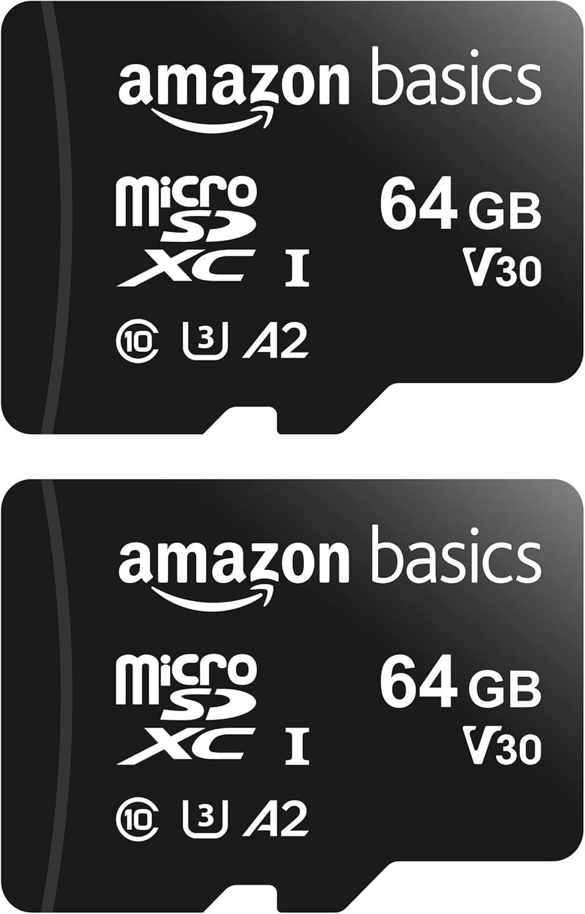
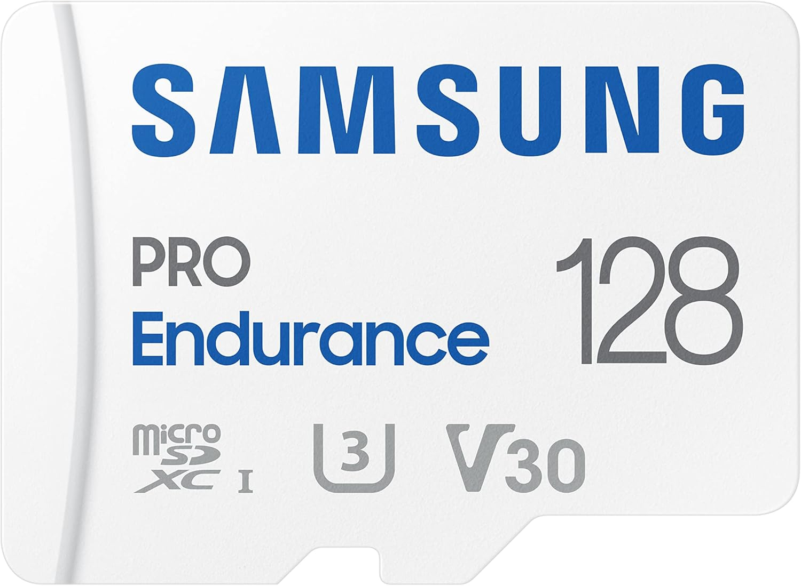
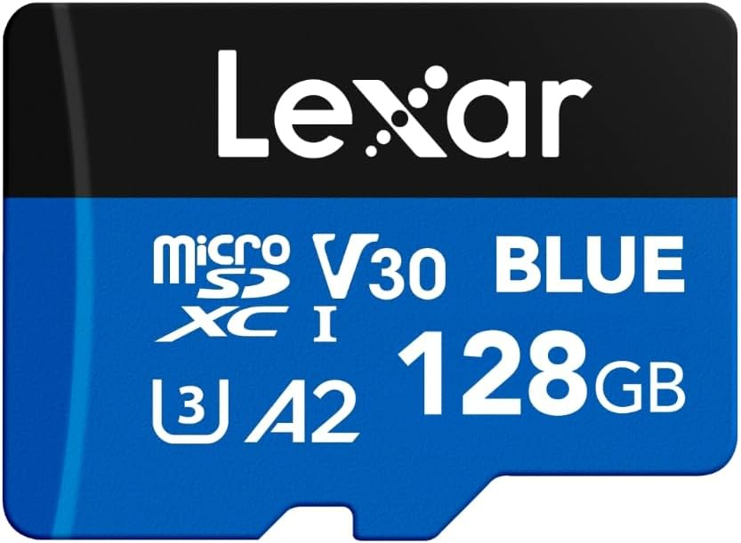
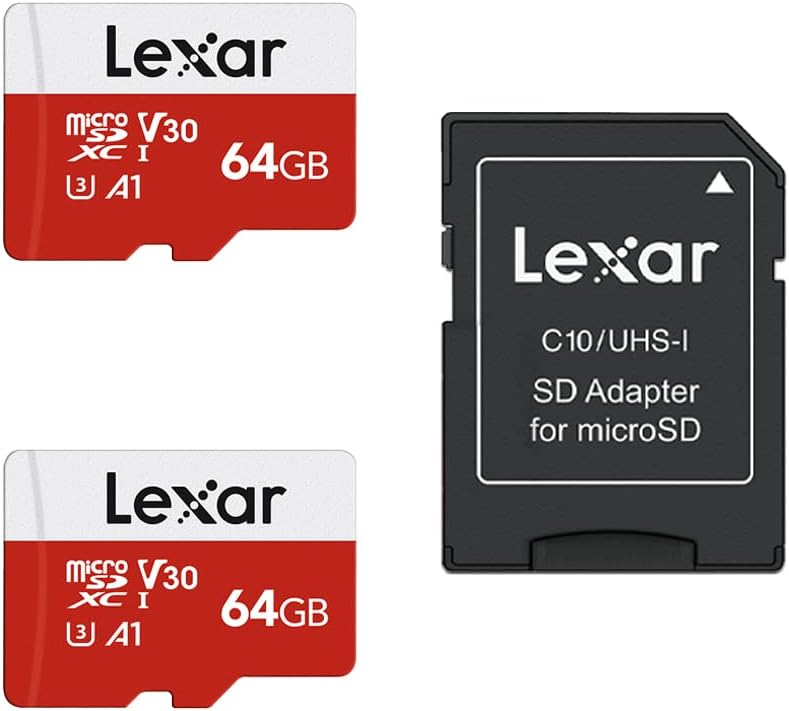
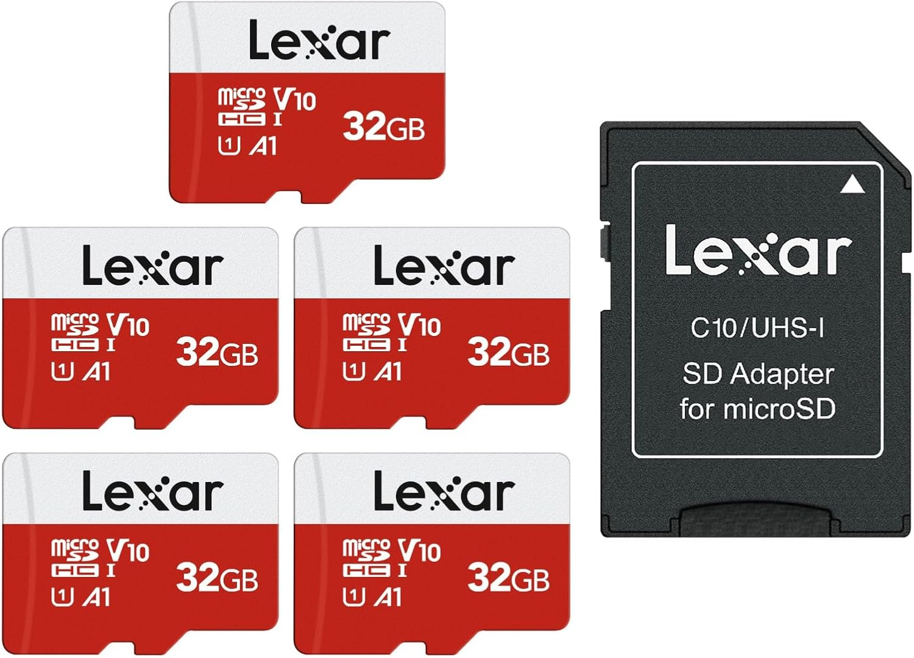
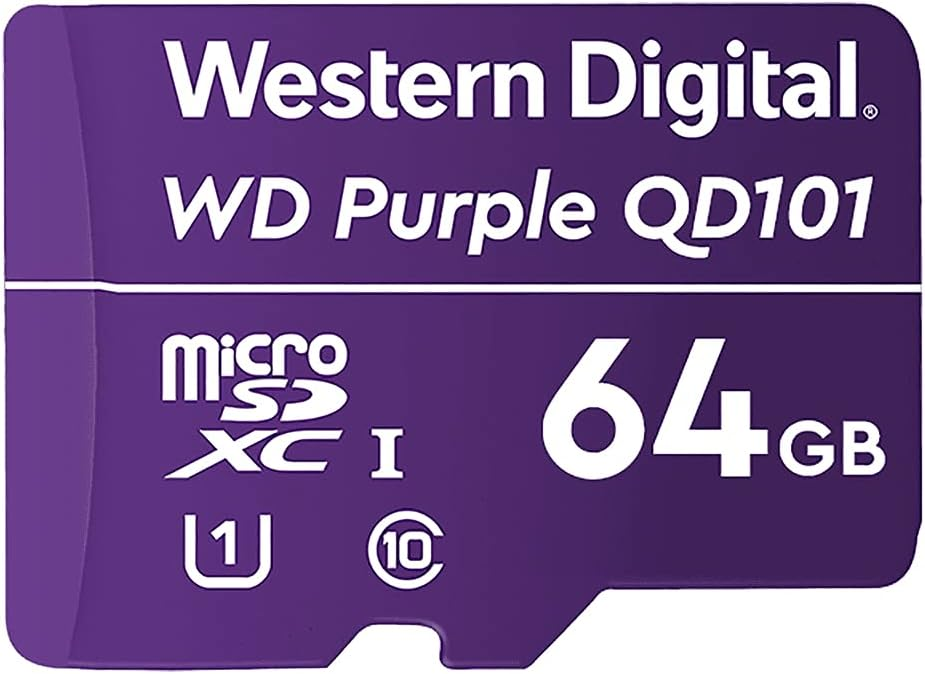
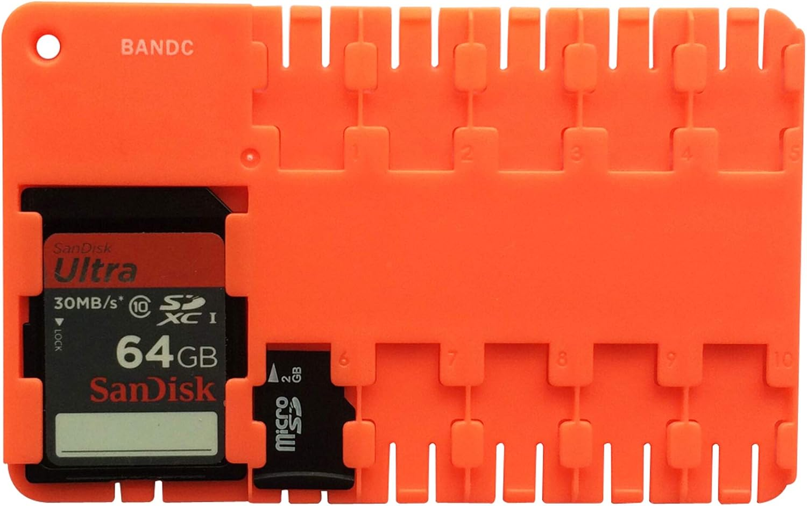

# SD Card Performance Guide

Comprehensive card identification, compatibility, and performance rankings for the P2 SD Card Driver.

---

## Contents

- [1. Understanding SD Card Markings](#1-understanding-sd-card-markings)
- [2. Identifying Your Card](#2-identifying-your-card)
- [3. Selecting Cards for P2 SPI](#3-selecting-cards-for-p2-spi)
- [4. Recommended Purchases](#4-recommended-purchases)
- [5. Tested Card Library](#5-tested-card-library)
- [6. Performance Rankings](#6-performance-rankings)
- [7. Key Observations](#7-key-observations)
- [8. Socket Timing Differences](#8-socket-timing-differences)

---

## 1. Understanding SD Card Markings

The SD Association defines card families by capacity, not bus type:

| Generation | Capacity | Native Filesystem | Notes |
|------------|----------|-------------------|-------|
| **microSD (SDSC)** | Up to 2 GB | FAT12/16 | Standard Capacity |
| **microSDHC** | 2–32 GB | FAT32 | High Capacity |
| **microSDXC** | 32 GB–2 TB | exFAT | Extended Capacity |
| **microSDUC** | 2–128 TB | exFAT | Ultra Capacity (rare) |

### Speed Class Markings

Speed markings describe minimum performance on UHS-I/II bus modes, **not SPI mode**:

| Category | Markings | Minimum Write Speed |
|----------|----------|---------------------|
| Speed Class | C2, C4, C6, C10 | 2 / 4 / 6 / 10 MB/s |
| UHS Speed Class | U1, U3 | 10 / 30 MB/s |
| Video Speed Class | V6, V10, V30, V60, V90 | 6–90 MB/s |
| Application Performance | A1, A2 | A1: 1,500/500 IOPS; A2: 4,000/2,000 IOPS |

**For SPI on microcontrollers:** All tested cards run at 25 MHz SPI regardless of speed class markings. Higher classes generally indicate better flash and controller quality, but UHS/Video/Application class ratings describe UHS bus performance and don't directly predict SPI throughput.

A1/A2 (Application Performance Class) is designed for app-launch performance on phones. A2 indicates command queuing and caching support — features that could benefit SPI workloads but are not exercised by our current benchmark protocol (which uses basic CMD17/CMD18/CMD24/CMD25 only).

---

## 2. Identifying Your Card

### The Two-Line Designator

Each card has a unique identity derived from its hardware registers (CID, CSD, SCR) — not from the printed label, which can be vague or misleading. The two-line designator is the authoritative identity of the card.

### How to Generate It

Run `SD_card_characterize.spin2` from the `UTILS/` directory:

```bash
cd src/UTILS/
pnut-ts -d -I .. SD_card_characterize.spin2
pnut-term-ts -r SD_card_characterize.bin
```

The utility reads the card's registers and produces a two-line designator.

Alternatively, if you're already running the **Demo Shell** (`SD_demo_shell.spin2`), use the `card` command at the shell prompt to display the same designator — no separate utility needed.

### How to Read It

```
Line 1: Manufacturer Product Type Capacity [FS] SD-Spec revN.N SN:XXXXXXXX YYYY/MM
Line 2: Class N, UN, AN, VN, SPI NN MHz  [volume-label]
```

| Field | Source | Example | Meaning |
|-------|--------|---------|---------|
| Manufacturer | CID MID+OID | `SanDisk` | Resolved from manufacturer ID registry |
| Product | CID PNM | `SN64G` | 5-character product code |
| Type | CSD capacity | `SDXC` | HC (4–32 GB) or XC (64 GB+) |
| Capacity | CSD C_SIZE | `59GB` | Usable capacity |
| [FS] | VBR/BPB | `[FAT32]` | Current filesystem |
| SD-Spec | SCR SD_SPEC fields | `SD 6.x` | SD specification version |
| revN.N | CID PRV | `rev8.6` | Product revision |
| SN | CID PSN | `$7E65_0771` | Serial number |
| YYYY/MM | CID MDT | `2022/11` | Manufacturing date |
| Class/U/A/V | SCR + SD_STATUS | `Class 10, U3, A2, V30` | Speed ratings from registers |
| SPI MHz | CSD TRAN_SPEED | `SPI 25 MHz` | Maximum SPI clock |
| [label] | VBR | `[P2FMTER]` | Volume label (identifies formatter) |

### Matching Your Card

If you run the characterization utility and get a designator that matches one of the tested cards below (same manufacturer, product code, and revision), you can expect similar performance. Cards with the same product code but different revisions may behave differently due to controller changes between manufacturing lots.

---

## 3. Selecting Cards for P2 SPI

The safest approach is to choose a card already tested in this document. If your card matches a designator in the [Tested Card Library](#5-tested-card-library) (same manufacturer, product code, and revision), you can expect similar performance.

### What the Benchmark Data Shows

Based on 15 cards benchmarked at both 350 MHz and 250 MHz:

- **Top tier (score 88–99):** Four cards score 88 or above — Amazon Basics 64GB, Samsung PRO Endurance 128GB, Lexar PLAY 128GB, and Lexar V30 64GB. These deliver 1,200–1,444 KB/s file reads and 400–774 KB/s file writes.
- **Mid tier (score 74–81):** Seven cards cluster between 74 and 81 — five SanDisk models, WD Purple, and Gigastone Camera Plus. File reads 990–1,103 KB/s, file writes 293–445 KB/s. Adequate for most embedded workloads.
- **Bottom tier (score 52–70):** Four cards score below 74 — Samsung EVO Select, SanDisk Industrial, Gigastone High Endurance, and PNY. File writes below 323 KB/s; PNY single-sector writes are 17x slower than the best card.

### Right-Sizing Your Card

For embedded systems, bigger is not better. Larger cards carry hidden costs:

- **Longer mount times** — The driver reads the FAT and FSInfo structures at mount. Larger cards have larger FATs, and some cards with large flash arrays exhibit higher internal access latency.
- **Longer FSCK scans** — Pass 4 (FAT sync) reads every FAT sector sequentially. A 16 GB card with 15K sectors/FAT takes ~37 seconds; a 128 GB card takes proportionally longer. Full chain validation (passes 2–3) is limited to cards under ~64 GB by the P2's hub RAM.
- **Wasted capacity** — Most embedded data logging, configuration storage, and sensor recording applications use megabytes, not gigabytes. A 128 GB card sitting 99.9% empty is paying the overhead of a large FAT for no benefit.

**Recommendation:** Choose the smallest card that comfortably exceeds your storage needs. For typical embedded workloads:

| Application | Suggested Card Size |
|-------------|-------------------|
| Configuration files, small logs | 4–8 GB |
| Data logging, sensor recording | 8–16 GB |
| Image storage, large datasets | 16–32 GB |
| Audio/video buffering | 32–64 GB |

Cards in the 8–32 GB range offer the best balance of capacity, mount performance, and full FSCK coverage. Cards above 64 GB work well for read/write operations but receive only structural FSCK checks (no chain validation or lost cluster recovery).

### Using Card Markings as a Guide

If you can't test a card, register-derived markings provide a rough guide (see [correlation table](#7-key-observations) in Section 7):

- **U3 + V30** cards average score 83 vs. **U1 + V10** average 65 — but the ranges overlap, so this is a tendency, not a guarantee
- **A2** does not predict SPI throughput in our benchmarks — however, A2 specifies command queuing and caching features that could benefit SPI workloads if utilized
- **Speed Class (C4 vs C10)** has only one C4 card (PNY, score 52) — insufficient data to draw conclusions

---

## 4. Recommended Purchases

Cards recommended based on our benchmark data. Ranks and scores reference the [Performance Rankings](#6-performance-rankings). Prices are Amazon US as of February 2026.

**Format every card before use.** Newly purchased cards — even FAT32-formatted SDHC cards — typically ship with vendor content you don't need and incomplete filesystem metadata (missing free-space counts, inconsistent volume information). The included `SD_format_card.spin2` utility produces a clean, consistent FAT32 filesystem with correct metadata. SDXC cards (64 GB+) ship with exFAT and *must* be reformatted to FAT32 for the P2 driver, but we recommend formatting all cards regardless of type.

<table>
<tr>
<td width="160"></td>
<td>
<b><a href="https://www.amazon.com/dp/B08TJTB8XS">Amazon Basics MicroSD 64 GB (2-Pack)</a></b> — $23.97 / $11.99 per card<br><br>
Rank <b>1</b> · Score <b>99</b> · Excellent<br><br>
Top-ranked card at the lowest per-card cost. Uses a Longsys/Lexar controller internally — which explains why it performs on par with the Lexar-branded cards.
</td>
</tr>
</table>

<table>
<tr>
<td width="160"></td>
<td>
<b><a href="https://www.amazon.com/dp/B09WB1857W">Samsung PRO Endurance 128GB MicroSD</a></b> — $48.99<br><br>
Rank <b>2</b> · Score <b>98</b> · Excellent<br><br>
Near-identical score to #1 with 128 GB capacity. Designed for continuous-write surveillance and dashcam use — built for endurance.
</td>
</tr>
</table>

<table>
<tr>
<td width="160"></td>
<td>
<b><a href="https://www.amazon.com/dp/B0DZ5H1M6B">Lexar 128GB Blue Micro SD Card</a></b> — $36.99<br><br>
Rank <b>3</b> · Score <b>91</b> · Excellent<br><br>
Best balance of capacity and cost at 128 GB. Strongest file-read performance (1,444 KB/s at 350 MHz).
</td>
</tr>
</table>

<table>
<tr>
<td width="160"></td>
<td>
<b><a href="https://www.amazon.com/dp/B09JNKHJ2Q">Lexar 64GB Micro SD Card (2-Pack)</a></b> — $34.99 / $17.50 per card<br><br>
Rank <b>4</b> · Score <b>88</b> · Very Good<br><br>
Same product line as our tested Lexar Red 64GB. Good all-around performer with strong file-read throughput.
</td>
</tr>
</table>

<table>
<tr>
<td width="160"></td>
<td>
<b><a href="https://www.amazon.com/dp/B0CPDGYLGC">Lexar E-Series 32GB Micro SD Card (5-Pack)</a></b> — $59.99 / $12.00 per card<br><br>
Rank <b>4</b> · Score <b>88</b> (tested as 64GB) · Very Good<br><br>
Same Lexar product line at lowest per-card cost for quantity. 32 GB SDHC — ships with FAT32 natively. Our benchmark was on the 64GB version; 32GB should perform similarly.
</td>
</tr>
</table>

<table>
<tr>
<td width="160"></td>
<td>
<b><a href="https://www.amazon.com/dp/B088CFSPV6">Western Digital WD Purple QD101 64GB</a></b> — $21.90<br><br>
Rank <b>10</b> · Score <b>74</b> · Good<br><br>
Surveillance-grade endurance card. Mid-tier SPI performance but SanDisk/WD controller with reliable SPI microcode.
</td>
</tr>
</table>

### Card Storage

<table>
<tr>
<td width="160"></td>
<td>
<b><a href="https://www.amazon.com/dp/B018RUWK98">BANDC Micro SD Card Storage Holder (2-Pack)</a></b> — $6.94 / $3.47 each<br><br>
Holds 1 full-size SD + 10 microSD cards. Compact, durable cases — the author's favorite for keeping test cards organized.
</td>
</tr>
</table>

---

## 5. Tested Card Library

22 cards across 8 manufacturers. **Benchmarked** cards appear in the [Performance Rankings](#6-performance-rankings) with full throughput data. **Characterized** cards have register data but no standard benchmark. **Blocked** cards failed to initialize fully. **Cataloged** cards are identified only.

### Benchmarked (15 cards)

| Card | Capacity | Label Markings | Register Markings | Rank |
|------|----------|----------------|-------------------|:----:|
| Amazon Basics microSD XC I 64GB | 64 GB | (10) U3 A2 V30 | (10) U3 A2 V30 | 1 |
| Gigastone "Camera Plus" microSD XC I 64GB | 64 GB | A1 V30 U3 | (10) U3 V30 | 11 |
| Gigastone "High Endurance" 10x MLC microSD HC I 16GB | 16 GB | U3 V30 | (10) U1 V10 | 14 |
| Lexar PLAY A2 microSD XC 128GB (Blue) | 128 GB | A2 | (10) U3 A2 V30 | 3 |
| Lexar A1 V30 U3 microSD XC 64GB (Red) | 64 GB | A1 V30 U3 | (10) U3 A2 V30 | 4 |
| PNY microSD HC I 16GB | 16 GB | — | C4 | 15 |
| Samsung EVO Select microSD XC I 128GB | 128 GB | U3 | (10) U3 | 12 |
| Samsung PRO Endurance microSD XC I 128GB | 128 GB | (10) U3 V30 | (10) U3 A2 V30 | 2 |
| SanDisk Extreme microSD XC I 64GB | 64 GB | U3 A2 V30 | (10) U3 A2 V30 | 7 |
| SanDisk Extreme PRO microSD XC I 64GB | 64 GB | V30 U3 | (10) U3 V30 | 5 |
| SanDisk Extreme PRO microSD XC I 128GB | 128 GB | V30 U3 A1 | (10) U3 V30 | 6 |
| SanDisk Industrial microSD HC I 16GB | 16 GB | U1 C10 | (10) U1 V10 | 13 |
| SanDisk MAX ENDURANCE microSD HC I 32GB | 32 GB | U3 V30 (10) | (10) U3 A2 V30 | 8 |
| SanDisk Nintendo Switch microSD XC I 128GB | 128 GB | — | (10) U3 A2 V30 | 9 |
| WD Purple QD101 microSD XC I 64GB | 64 GB | U1 (10) | (10) U1 A2 V10 | 10 |

### Blocked (1 card)

| Card | Capacity | Designator | Issue |
|------|----------|------------|-------|
| SP Elite microSD XC UHS-I 64GB | 64 GB | `SharedOEM SPCC SDXC 57GB SD 6.x rev0.7` | CMD18 multi-block read times out; mount fails |

### Cataloged (6 cards)

| Card | Capacity | Designator |
|------|----------|------------|
| Gigastone microSD HC 32GB | 32 GB | `Gigastone 00000 SDHC 29GB SD 3.x` |
| Gigastone microSD HC 8GB | 8 GB | `Gigastone 00000 SDHC 7GB SD 3.x` |
| SanDisk Ultra microSD HC 8GB | 8 GB | `SanDisk SU08G SDHC 7GB SD 3.x` |
| SanDisk microSD HC 8GB | 8 GB | `SanDisk SS08G SDHC 7GB SD 3.x` |
| Kingston microSD HC 8GB | 8 GB | `Kingston SD8GB SDHC 7GB SD 3.x` |
| Samsung microSD HC 8GB | 8 GB | `Samsung 00000 SDHC 7GB SD 3.x` |

---

## 6. Performance Rankings

### Methodology

Six metrics are measured at two system clock speeds (350 MHz and 250 MHz), both producing 25 MHz SPI. The higher SYSCLK reduces Spin2 inter-transfer overhead between SPI bursts, yielding 10–20% better file throughput. Each metric is normalized against the best card (best = 100), then weighted:

| Metric | Weight | Description |
|--------|-------:|-------------|
| File Read 256KB | 25% | Read a 256 KB file through the FAT32 API |
| File Write 32KB | 20% | Write a 32 KB file through the FAT32 API |
| Raw Multi-Sector Read (64x) | 20% | 64 consecutive sectors via CMD18 |
| Raw Multi-Sector Write (64x) | 20% | 64 consecutive sectors via CMD25 |
| Raw Single-Sector Read (1x) | 10% | Single sector via CMD17 |
| Raw Single-Sector Write (1x) | 5% | Single sector via CMD24 |

Multi-sector operations carry 40% combined weight to reflect real embedded workloads where data moves in 4K–32K chunks.

### Score Tiers

| Tier | Score | Meaning |
|------|------:|---------|
| **Excellent** | 90–100 | Top-tier performance across all metrics |
| **Very Good** | 75–89 | Strong performance, minor weaknesses |
| **Good** | 60–74 | Adequate for most applications |
| **Adequate** | 50–59 | Functional but noticeably slower |
| **Poor** | < 50 | Significant performance limitations |

---

### Performance Ranking

*Ranked by average of 350/250 MHz composite scores. Both speeds use 25 MHz SPI — the difference is Spin2 inter-transfer overhead. All throughput values in KB/s.*

| Rank | Card / Designator | MHz | Score | File Rd | File Wr | Rd 64x | Wr 64x | Rd 1x | Wr 1x |
|:----:|:-------------------|:---:|------:|--------:|--------:|-------:|-------:|------:|------:|
| | | | | | | | | | |
| 1 | Amazon Basics microSD XC I 64GB — (10) U3 A2 V30 | | | | | | | | |
| | `Longsys/Lexar USD00 SDXC 58GB [FAT32] SD 6.x rev2.0 SN:$3584_1E2E 2025/07` | 350 | **99** | 1,386 | 774 | 2,425 | 2,305 | 1,245 | 846 |
| | `Class 10, U3, A2, V30, SPI 25 MHz  [P2FMTER]` | 250 | **98** | 1,203 | 686 | 2,234 | 2,106 | 1,057 | 766 |
| | | | | | | | | | |
| 2 | Samsung PRO Endurance microSD XC I 128GB — (10) U3 V30 | | | | | | | | |
| | `Samsung JD1Y7 SDXC 119GB [FAT32] SD 6.x rev3.0 SN:D27654A6 2025/12` | 350 | **98** | 1,419 | 758 | 2,427 | 2,319 | 1,283 | 617 |
| | `Class 10, U3, A2, V30, SPI 25 MHz  [P2FMTER]` | 250 | **98** | 1,231 | 709 | 2,239 | 2,108 | 1,071 | 577 |
| | | | | | | | | | |
| 3 | Lexar PLAY A2 microSD XC 128GB (Blue) | | | | | | | | |
| | `Lexar MSSD0 SDXC 117GB [FAT32] SD 6.x rev6.1 SN:34490F1E 2025/04` | 350 | **91** | 1,444 | 616 | 2,420 | 2,275 | 819 | 680 |
| | `Class 10, U3, A2, V30, SPI 25 MHz  [P2FMTER]` | 250 | **91** | 1,256 | 551 | 2,233 | 2,082 | 745 | 623 |
| | | | | | | | | | |
| 4 | Lexar A1 V30 U3 microSD XC 64GB (Red) | | | | | | | | |
| | `Lexar MSSD0 SDXC 58GB [FAT32] SD 6.x rev6.1 SN:33549024 2024/11` | 350 | **88** | 1,378 | 433 | 2,376 | 2,251 | 1,239 | 674 |
| | `Class 10, U3, A2, V30, SPI 25 MHz  [P2FMTER]` | 250 | **88** | 1,190 | 396 | 2,181 | 2,048 | 1,066 | 631 |
| | | | | | | | | | |
| 5 | SanDisk Extreme PRO microSD XC I 64GB — V30 U3 | | | | | | | | |
| | `SanDisk AGGCE SDXC 59GB [FAT32] SD 5.x rev8.0 SN:DD1C1144 2017/03` | 350 | **80** | 1,101 | 437 | 2,408 | 2,210 | 998 | 428 |
| | `Class 10, U3, V30, SPI 25 MHz  [P2FMTER]` | 250 | **81** | 983 | 414 | 2,220 | 2,022 | 879 | 403 |
| | | | | | | | | | |
| 6 | SanDisk Extreme PRO microSD XC I 128GB — V30 U3 A1 | | | | | | | | |
| | `SanDisk AGGCF SDXC 119GB [FAT32] SD 5.x rev8.0 SN:E05C352B 2017/07` | 350 | **78** | 1,103 | 445 | 2,408 | 2,140 | 842 | 427 |
| | `Class 10, U3, V30, SPI 25 MHz  [P2FMTER]` | 250 | **81** | 987 | 418 | 2,220 | 2,023 | 879 | 404 |
| | | | | | | | | | |
| 7 | SanDisk Extreme microSD XC I 64GB — U3 A2 V30 | | | | | | | | |
| | `SanDisk SN64G SDXC 59GB [FAT32] SD 6.x rev8.6 SN:$7E65_0771 2022/11` | 350 | **76** | 1,040 | 378 | 2,408 | 2,150 | 1,005 | 331 |
| | `Class 10, U3, A2, V30, SPI 25 MHz  [P2FMTER]` | 250 | **78** | 936 | 359 | 2,220 | 1,980 | 887 | 316 |
| | | | | | | | | | |
| 8 | SanDisk MAX ENDURANCE microSD HC I 32GB — U3 V30 (10) | | | | | | | | |
| | `SanDisk SH32G SDHC 29GB [FAT32] SD 6.x rev8.0 SN:$5BFE_CCD8 2025/08` | 350 | **76** | 1,036 | 367 | 2,407 | 2,154 | 998 | 330 |
| | `Class 10, U3, A2, V30, SPI 25 MHz  [P2FMTER]` | 250 | **77** | 929 | 353 | 2,220 | 1,965 | 887 | 318 |
| | | | | | | | | | |
| 9 | SanDisk Nintendo Switch microSD XC I 128GB | | | | | | | | |
| | `SanDisk SN128 SDXC 119GB [FAT32] SD 6.x rev8.0 SN:F79E34F6 2019/12` | 350 | **75** | 1,016 | 378 | 2,406 | 2,152 | 887 | 332 |
| | `Class 10, U3, A2, V30, SPI 25 MHz  [P2FMTER]` | 250 | **77** | 919 | 361 | 2,222 | 1,929 | 847 | 316 |
| | | | | | | | | | |
| 10 | WD Purple QD101 microSD XC I 64GB — U1 (10) | | | | | | | | |
| | `SanDisk WX64G SDXC 59GB [FAT32] SD 6.x rev8.0 SN:$EEBA_D6C0 2024/03` | 350 | **74** | 990 | 362 | 2,403 | 2,148 | 920 | 333 |
| | `Class 10, U1, A2, V10, SPI 25 MHz  [P2FMTER]` | 250 | **76** | 856 | 345 | 2,217 | 1,998 | 850 | 325 |
| | | | | | | | | | |
| 11 | Gigastone "Camera Plus" microSD XC I 64GB — A1 V30 U3 | | | | | | | | |
| | `Gigastone ASTC SDXC 58GB [FAT32] SD 6.x rev2.0 SN:00000F14 2023/06` | 350 | **72** | 1,091 | 293 | 2,134 | 2,142 | 915 | 349 |
| | `Class 10, U3, V30, SPI 25 MHz  [P2FMTER]` | 250 | **73** | 978 | 282 | 1,912 | 1,949 | 820 | 328 |
| | | | | | | | | | |
| 12 | Samsung EVO Select microSD XC I 128GB — U3 | | | | | | | | |
| | `Samsung GD4QT SDXC 119GB [FAT32] SD 3.x rev3.0 SN:4AC85F42 2018/05` | 350 | **70** | 835 | 323 | 2,348 | 2,110 | 914 | 425 |
| | `Class 10, U3, SPI 25 MHz  [P2FMTER]` | 250 | **73** | 844 | 328 | 2,134 | 1,981 | 693 | 362 |
| | | | | | | | | | |
| 13 | SanDisk Industrial microSD HC I 16GB — U1 C10 | | | | | | | | |
| | `SanDisk SA16G SDHC 14GB [FAT32] SD 5.x rev8.0 SN:93E9C0A1 2025/11` | 350 | **68** | 869 | 264 | 2,387 | 2,166 | 824 | 235 |
| | `Class 10, U1, V10, SPI 25 MHz` | 250 | **70** | 794 | 254 | 2,200 | 1,980 | 742 | 320 |
| | | | | | | | | | |
| 14 | Gigastone "High Endurance" 10x MLC microSD HC I 16GB — U3 V30 | | | | | | | | |
| | `Budget OEM SD16G SDHC 14GB [FAT32] SD 3.x rev2.0 SN:000003FB 2025/02` | 350 | **53** | 659 | 109 | 2,090 | 1,868 | 576 | 143 |
| | `Class 10, U1, V10, SPI 25 MHz  [P2FMTER]` | 250 | **54** | 617 | 108 | 1,877 | 1,712 | 535 | 141 |
| | | | | | | | | | |
| 15 | PNY microSD HC I 16GB | | | | | | | | |
| | `Phison SD16G SDHC 14GB [FAT32] SD 3.x rev3.0 SN:$01CD_5CF5 2018/08` | 350 | **52** | 747 | 192 | 2,376 | 1,037 | 734 | 50 |
| | `Class 4, U0, V0, SPI 25 MHz  [P2FMTER]` | 250 | **55** | 695 | 185 | 2,194 | 997 | 677 | 53 |

---

## 7. Key Observations

- **The driver runs every card at 25 MHz SPI by default**, regardless of speed
  class markings. That is the SD specification's SPI-mode ceiling, and it is
  where the driver clamps.

- **CMD6 High Speed mode DOES work on many cards** — corrected 2026-08-18. This
  section previously stated that the switch "fails on all tested cards". That was
  wrong, and it had been wrong for some time: the claim came from an era when the
  driver's own high-speed verification could not succeed. Of four modern cards
  retested, **three negotiate high speed and hold it**; only one declines.

  What you get, and what it costs:

  | | Result |
  |---|---|
  | Clock reached | **43.75 MHz** at 350 MHz sysclk — not 50 MHz. The SPI clock is `sysclk / (2 x hp)`, and no integer divisor lands on 50 |
  | Sequential reads | **Up to +47%** — measured on multi-block reads across three cards |
  | Single-sector reads | Little or no gain. Card seek latency dominates, and the bus was never the limit |
  | Writes | **Correct, but not faster.** Every write verified byte-for-byte at high speed across three cards. One card of three is reproducibly slower (−52% on single-sector); one is faster; one showed a large apparent regression that did not reproduce. Do not assume writes benefit |

  **It is opt-in.** `attemptHighSpeed()` is gated behind `SD_INCLUDE_SPEED` and
  the driver does not negotiate high speed on its own; the production speed bound
  remains 25 MHz. Correctness at 43.75 MHz is established — writes verify clean
  and the write-path phase pad was measured safe there — so what stands between
  this and an automatic mode is a product decision about read/write asymmetry,
  not a safety one.

  Use `isHighSpeedActive()` to ask whether the card is in high-speed mode and
  `getSPIFrequency()` for the clock — they answer different questions, and on
  most sysclk values the frequency is not 50 MHz even when the mode is active.

- **Raw multi-sector reads are nearly identical across major-brand cards** (2,348–2,427 KB/s at 350 MHz for SanDisk/Samsung/Lexar/Amazon). Gigastone OEM controllers are slightly lower (2,090–2,134 KB/s). The SPI bus is the bottleneck for sustained reads.

- **File-write performance is the biggest differentiator.** File write throughput ranges from 109 to 774 KB/s at 350 MHz — a 7x spread driven by internal flash controller speed.

- **350 MHz vs 250 MHz: 10–20% gain on file operations.** Both produce the same 25 MHz SPI clock, but higher SYSCLK reduces Spin2 inter-transfer overhead between SPI bursts.

- **SanDisk Extreme PRO cards deliver strong mid-tier performance.** Both the 64GB and 128GB variants score 78–80 with the best file-write throughput (437–445 KB/s) among SanDisk consumer cards.

- **PNY/Phison and Gigastone High Endurance: extremely slow writes.** The Phison controller produces 50 KB/s single-sector writes at 350 MHz — 17x slower than the best cards. The Gigastone High Endurance MLC card trades speed for durability (109 KB/s file writes).

- **Samsung EVO Select: internal controller latency dominates.** File read throughput at 350 MHz (835 KB/s) is actually lower than at 250 MHz (844 KB/s) for this card — the controller's internal latency overshadows the Spin2 overhead savings.

- **A1/A2 markings don't predict SPI performance in our benchmarks.** A2 specifies command queuing and cache management features that could benefit SPI workloads, but our benchmark uses basic CMD17/CMD18/CMD24/CMD25 only. Cards with A2 (score range 74–99, avg 84) overlap heavily with cards without (52–80, avg 68).

- **Card markings vs. SPI benchmark correlation** (register-derived values, 350 MHz scores):

  | Marking | Level | Cards | Score Range | Avg |
  |---------|-------|:-----:|:----------:|:---:|
  | UHS Speed | U3 | 11 | 70–99 | 81 |
  | | U1 | 3 | 53–75 | 65 |
  | Video Speed | V30 | 10 | 72–99 | 83 |
  | | V10 | 3 | 53–74 | 65 |
  | App Performance | A2 | 8 | 74–99 | 84 |
  | | — | 7 | 52–80 | 68 |

  UHS and Video class show moderate group-level correlation — not because the bus mode matters in SPI, but because the flash quality and controller sophistication needed to achieve U3/V30 also tends to perform better over SPI. The overlapping score ranges mean these markings are not a reliable substitute for actual SPI benchmarking.

- **Label markings can disagree with register data.** Several cards show different speed class ratings on their physical label vs. their SD Status register. Register data (from the characterization utility) is authoritative.

- **Samsung PRO Endurance and Amazon Basics lead at both speeds** with near-identical scores (98–99). At 250 MHz, Samsung PRO Endurance takes the top spot; at 350 MHz, Amazon Basics edges ahead due to stronger single-sector write performance.

---

## 8. Socket Timing Differences

Two physical sockets on the same P2 Edge bench — the module's onboard microSD
socket and an external header-wired adapter socket — were characterized against
each other on 2026-08-17 (13 runs, cards swapped between sockets to separate
card effects from socket effects). The numbers below are **out-of-spec stress
characterization**: the SD specification caps SPI at 25 MHz, and the boundaries
were found by deliberately driving past it.

| | Onboard (Edge) socket | External adapter socket |
|---|---|---|
| Command-path ceiling | **≥ 43.75 MHz** (clean at every frequency reachable at 350 MHz sysclk) | cliff in **(36.25, 37.50] MHz** — sharp, no degraded band |
| Extra round-trip delay vs. onboard | — (reference) | **~3 ns class** (bounded 0 < Δt ≤ ~5.7 ns) |
| Margin at production 25 MHz | ≥ 75% | ≥ 45% |

What this means in practice:

- **At the production 25 MHz both sockets carry wide margin** for every
  mainstream card measured. The socket difference does not affect normal
  operation with healthy cards.
- **The difference is real and card-independent** — the same boundaries appeared
  on four cards across two unrelated families (mainstream SDHC and
  counterfeit-class SDSC), and physical card swaps moved nothing.
- **Marginal cards feel the difference first.** A card whose own clock-to-output
  timing is slow (measured on counterfeit-class SDSC silicon) loses its streamer
  read alignment ~one frequency step earlier in the adapter socket than in the
  onboard socket. A card that misbehaves in one socket and not the other is
  reporting *its own* thin margin plus the socket delta — see the mechanism
  section in `SD-CARD-DRIVER-THEORY.md` (Receive Alignment and Socket Timing)
  and the per-card records in `DOCs/cards/`.

Measurement conditions: 350 MHz sysclk (plus a 290–336 MHz sysclk ladder to
place cells between the 350 MHz frequency grid points), sector reads scored by
CRC and byte-compare against a low-speed reference, ±1 sysclk tick (2.857 ns)
resolution. The full account, including the method and its limits, is in [Socket Timing Characterization](SD-SOCKET-TIMING-CASE-STUDY.md).

---

## Document History

| Date | Change |
|------|--------|
| 2026-08-17 | Added section 8: socket timing differences (onboard vs. external adapter), from the socket characterization campaign |
| 2026-02-25 | Added purchase recommendations with images; reordered sections; expanded to 15 benchmarked cards; added register markings and rank columns; merged 350/250 MHz ranking tables; added correlation analysis |
| 2026-02-24 | Initial release — 11 benchmarked cards, 22-card library |

---

*Part of the [P2 microSD FAT32 Filesystem](../README.md) project — Iron Sheep Productions*
